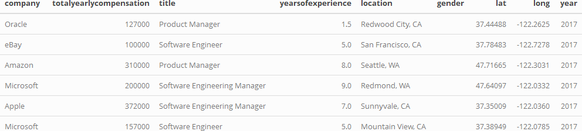

## Why is it important?

-   If you're looking to make more money in your career, understanding how it works and where companies offer higher TC will help you set goals more realistically.
-   Good for negotiation and you can see how you're being compensated compared to your peers at the company.
-   Understanding in which areas companies will pay more money as an employee
-   Understanding what you can expect to be paid as a Software Engineer vs Product Manager vs Data Scientist

## Datasets

```{r, echo=FALSE, warning=FALSE, message=FALSE, out.width="100%"}

```

```{r, echo=FALSE, warning=FALSE, message=FALSE}
library(shiny)
library(tidyverse)
library(ggplot2)  
library(plotly)
library(kableExtra)
library(tidyr)
library(cartogram)
# devtools::install_github("hrbrmstr/albersusa")
library(albersusa)
library(sf)
library(dplyr)
library(shinyWidgets)
Sys.setenv("MAPBOX_TOKEN" = "pk.eyJ1IjoidGltb3RoeW5ndXllIiwiYSI6ImNrbW8wZmR0OTF6cnoycHQ0ZXFydTBwY3oifQ.LumCjldRn9X9jX70p1BA-w")
```

```{r, echo=FALSE}
levels_df <- read.csv("./levels-cleaned.csv")
drop <- c("X", "timestamp")
levels_df <- levels_df[,!(names(levels_df) %in% drop)]
levels_df <- levels_df %>%
                drop_na(basesalary)  %>%
                drop_na(title) %>%
                drop_na(stockgrantvalue) %>%
                drop_na(bonus)
```

## What's the general total compensation package based on YOE and location?

```{r, echo=FALSE}

ui <-
  fluidPage(
    # App title
    titlePanel("Years of Experience, Location & Total Compensation"),
    
    # sidebar layout with input and output definitions
    sidebarLayout(
      # Sidebar panel for inputs
      sidebarPanel(
        sliderInput("yoe",
                    "Years of experience",
                    min = min(levels_df$yearsofexperience),
                    max = 30,
                    value = c(min(levels_df$yearsofexperience), 
                              30),
                    step = 1,
                    sep = "")
      ),
      
      # Main panel for displaying outputs
      mainPanel(
        plotlyOutput(outputId = "tc_loc")
      )
    ))
server <- function(input, output) {
  output$tc_loc <-
    renderPlotly({
      prep <- levels_df %>% 
        filter(yearsofexperience >= input$yoe[1] & 
              yearsofexperience <= input$yoe[2])
        
      tc <- aggregate(list(prep$totalyearlycompensation,
                       prep$basesalary,
                       prep$stockgrantvalue,
                       prep$bonus), 
                          by=list(location=prep$location), 
                          FUN=mean, na.action = na.omit)
      names(tc)[2] <- "tc"
      names(tc)[3] <- "basesalary"
      names(tc)[4] <- "stockgrantvalue"
      names(tc)[5] <- "bonus"
    
      location_df <- prep %>% 
        distinct(location, .keep_all = TRUE) %>%
        select(location, zip, lat, long, city, state)
      
      tc <- tc %>% left_join(location_df)
      
      fig <- tc
      fig %>%
        plot_mapbox() %>%
        add_markers(x = ~long,
                    y = ~lat,
                    color = ~state,
                    size = ~tc*1000^10,
                   text = ~paste0(location, "<br>",
                   "<b>Mean Yearly Compensation:</b> $", tc, "<br>",
                   "<b>Mean Salary Base:</b> $", basesalary, "<br>",
                   "<b>Mean stocks grants:</b> $", stockgrantvalue, "<br>",
                   "<b>Mean bonus:</b> $", bonus, "<br>")) %>%
        layout(
          mapbox = list(
            style = 'open-street-map',
            center = list(lon = -97, lat = 38),
            zoom = 2.5)) 
          })
}

shinyApp(ui, server)
```

## Which locations have higher compensation or lower compensation in America based of YOE?

```{r, warning=FALSE, echo=FALSE}

```

## Which companies have the highest compensation? Which companies will you get lower compensation?

## What roles pay the most in tech (total compensation)?

```{r, warning=FALSE, echo=FALSE}
con <- factor(unique(levels_df[c("title")])$title)
con2 <- factor(unique(levels_df[c("state")])$state)
ui <-
  fluidPage(
    # App title
    titlePanel("Roles in Tech"),
    
    # sidebar layout with input and output definitions
    sidebarLayout(
      # Sidebar panel for inputs
      sidebarPanel(
        sliderInput("yoe",
                    "Years of experience",
                    min = min(levels_df$yearsofexperience),
                    max = 30,
                    value = c(min(levels_df$yearsofexperience), 
                              30),
                    step = 1,
                    sep = ""),
         pickerInput(
            "statePicker",
            "Select/deselect all + format selected",
            choices = unique(con2),
            options = list('action-box' = TRUE),
            multiple=TRUE,
            selected="CA"
        ),
      ),
     
      
      # Main panel for displaying outputs
      mainPanel(
        plotOutput(outputId = "tc")
      )
    ))
server <- function(input, output) {

  output$tc <-
    renderPlot({
      
      prep <- levels_df %>% 
        filter(yearsofexperience >= input$yoe[1] & 
              yearsofexperience <= input$yoe[2])
    
      location_df <- prep %>% 
        distinct(state, .keep_all = TRUE) %>%
        select(state, zip, lat, long) %>% na.omit()

      tc <- prep
      if(length(input$statePicker) != 0) {
        tc <- tc %>%  
          filter(state %in% input$statePicker) 
      } 

      tc <- aggregate(list(tc = tc$totalyearlycompensation,
                           basesalary = tc$basesalary,
                           stockgrantvalue = tc$stockgrantvalue,
                           bonus = tc$bonus), 
                          by=list(title=tc$title), 
                          FUN=mean, na.action = na.omit)

      tc %>%
        mutate(title = fct_reorder(title, tc))%>%
        ggplot(aes(x = title, y = tc, fill = title)) + 
        geom_text(aes(y = tc, label = tc, hjust=0), size = 3) +
        geom_bar(stat = "identity")+
        coord_flip()+
        labs(x = "", y = "")+
        ggtitle(paste("Hello"))+
        theme(legend.title = element_blank(), legend.position = "none")
        
    })  
      
}

shinyApp(ui, server)
```

## Conclusion

-   Some of the locations where you're most likely going to make the most money based of YOE:

    -   Entry-Level (0 - 2 years)

    -   Mid-Level (2 - 5 years)

    -   Senior Level (5 - 10 Years)

    -   Above (10+ Years)

## Conclusion

-   Some of the locations where you're most likely going to make the most money based of YOE:

    -   Entry-Level (0 - 2 years)

        -   

    -   Mid-Level (2 - 5 years)

    -   Senior Level (5 - 10 Years)

    -   Above (10+ Years)

## Conclusion

-   Typically, the highest paid roles in tech (pretty consistent for first 10 years)

    -   Management Role (Software Engineer, Product Manager)

    -   Data Scientist

    -   Software Engineer

-   After 10 years, other positions in tech such as sales and product designer increase in pay rank (3rd from 10+ years experience). Professions such as SWE dips off or levels at some point.

## Resources

-   <https://www.levels.fyi/>
-   <https://public.opendatasoft.com/explore/dataset/us-zip-code-latitude-and-longitude/information/>

# Q & A
